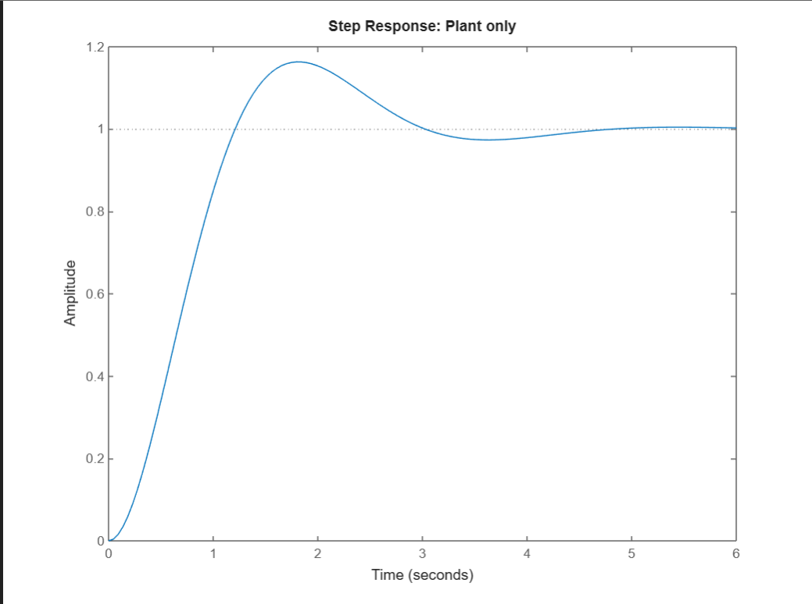
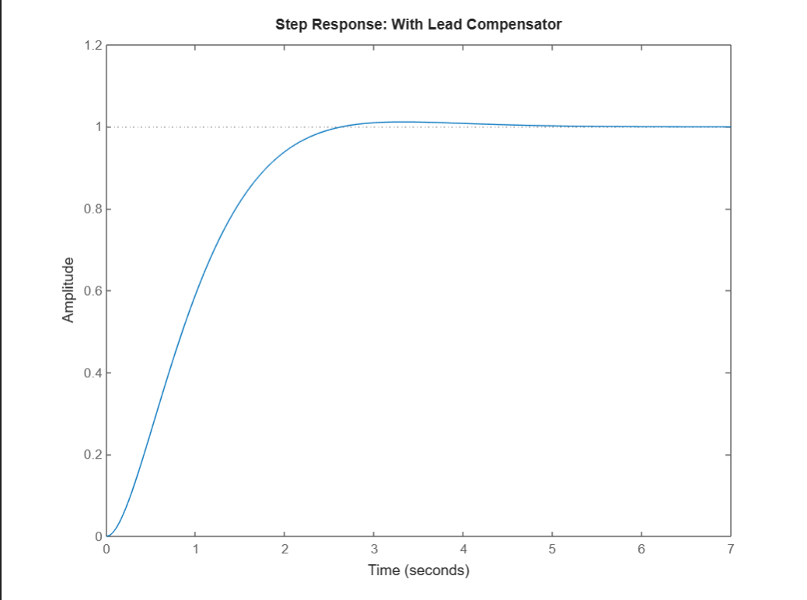
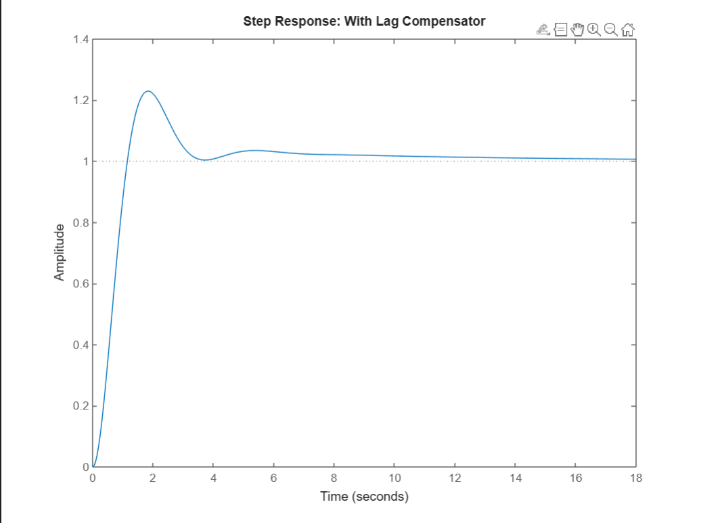
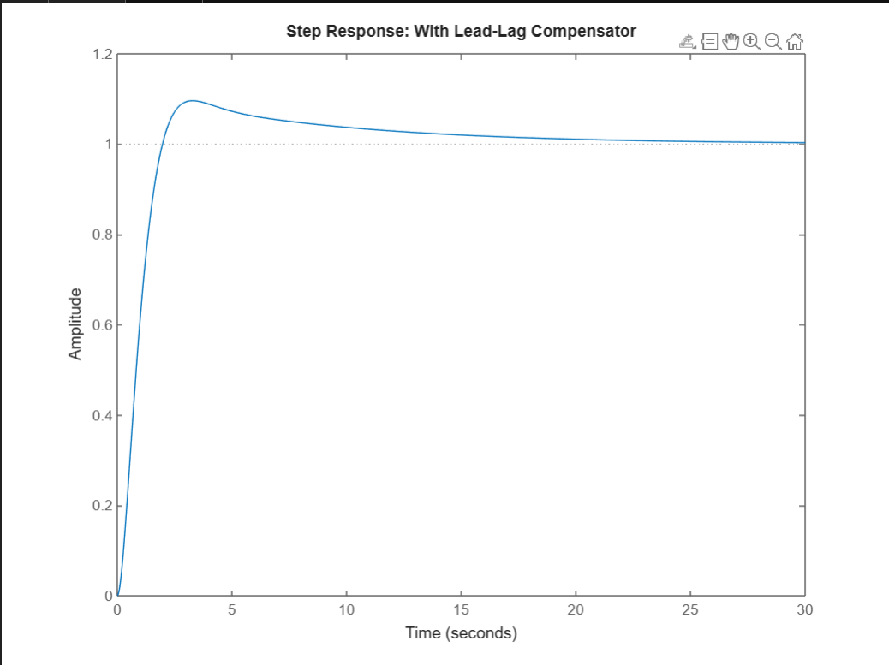
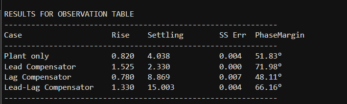

# README - Control System Compensator

This experiment explores the effects of lead, lag, and lead-lag compensators on a simple plant within a closed-loop control system using MATLAB.

## Objective

To understand and analyze how different compensators (lead, lag, lead-lag) modify the transient and steady-state response of a second-order plant.

## Background

A *compensator* is an electric (or computational) network designed to achieve desired system performance—specifically to improve transient response, steady-state error, and the stability of control systems.

### Types of Compensators

- **Lead Compensator**: Improves transient response, speeds up the system, increases phase margin.
- **Lag Compensator**: Improves steady-state accuracy, slightly increases phase margin, may slow system response.
- **Lead-Lag Compensator**: Aims to achieve both improved transient response and steady-state accuracy.

## System Data

- **Plant Transfer Function**:  
  $$ G(s) = \frac{4}{s^2 + 2s} $$

- **Lead Compensator**:  
  $$ G_{c,lead}(s) = \frac{s + 2.9}{s + 5.4} $$

- **Lag Compensator**:  
  $$ G_{c,lag}(s) = \frac{s + 0.111}{s + 0.01} $$

- **Lead-Lag Compensator**:  
  $$ G_{c,lead-lag}(s) = \left(\frac{s + 2.9}{s + 5.4}\right)\left(\frac{s + 0.111}{s + 0.01}\right) $$

## Files

- `Compensator_Experiment.m`: Main MATLAB script to run all cases (no compensator, lead, lag, lead-lag).

## Instructions

1. **Download and open** `Compensator_Experiment.m` in MATLAB.
2. **Run the script**. You will get:
    - Plots for step responses of all four systems.
    - A printed observation table containing Rise Time, Settling Time, Steady-State Error, and Phase Margin for each configuration.
3. **Analyze the results**:
    - **Observe** how compensators affect system speed and accuracy.
    - **Compare** your plotted step responses and printed table to theoretical expectations.

## Output

The script automatically computes and displays:

## Notes

- You can further extend the experiment by changing the plant's damping factor.
- Step response plots and data help **visualize** improvements in speed and accuracy due to each compensator.
- This experiment reinforces the practical impact of compensator design in feedback control.

## Troubleshooting

- Make sure the MATLAB Control System Toolbox is installed.
- If plots do not appear, ensure figures are not minimized or hidden behind MATLAB windows.
- For custom setups (varying plant parameters, more complex compensators), edit the transfer function coefficients in `Compensator_Experiment.m`.
